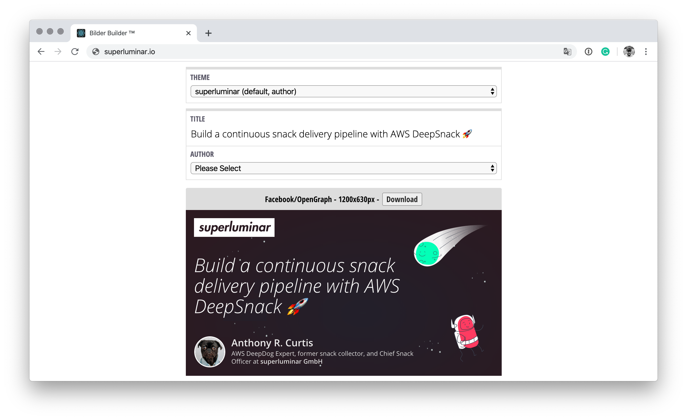

# Bilder Builder ™️

> Create images for OpenGraph meta tags.
>
> http://bilder-builder-files8e6940b8-u9jcssv71u3z.s3-website.eu-central-1.amazonaws.com/



## Development

```bash
# Install dependencies
$ > yarn install

# Start local environment
$ > yarn start
```

## Deployment

*Only* before first deploy bootstrap the AWS Account for CDK

```bash
# Bootstrap AWS account for CDK usage
npx cdk bootstrap --cloudformation-execution-policies arn:aws:iam::aws:policy/AdministratorAccess

# Install the pipeline
yarn cdk deploy BilderBuilderPipelineStack
```

The Pipeline is triggered automatically for master commits, keeps itself up to date and deploys to S3.
The Pipeline uses a Personal Access Token from Alexander Schramm/Miradorn as of 24.7.2020 to access the repository.
It is stored in AWS Secret Manager under `github-token`.
The Token needs to be changed if the Owner no longer has access to the Repo.
